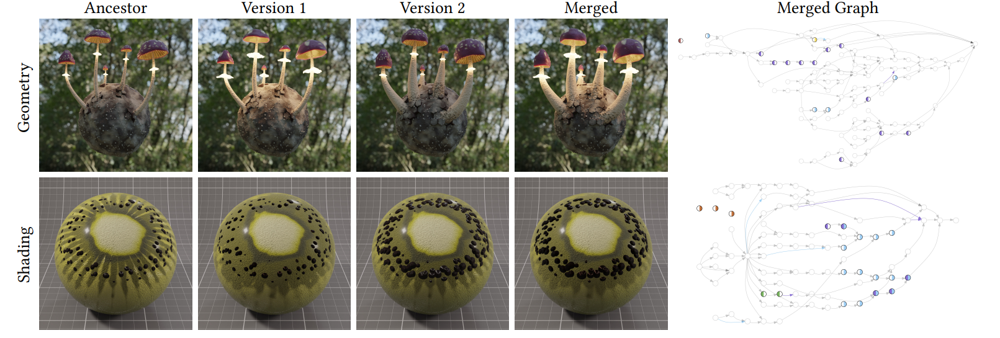

# NodeGit: Diffing and Merging Node Graphs
*NodeGit* is a framework that allow users to implement diff and merge versioning primitives for a given visual scripting language.



This code is crafted for research and educational purposes. It is not recommended to use it in production environments or large-scale projects. The primary goal is to showcase algorithmic concepts and simplify the reproduction of the paper [[NodeGit: Diffing and Merging Node Graphs](https://doi.org/10.1145/3618343)].

## Repository structure
This repository is composed by:

- `lib`: contains all *NodeGit* implemented libraries; at the moment it is only implemented the main module "`nodediff`", which provides interface data structures and functions to diff and merge functions.
- `examples`: contains several *NodeGit*'s usage examples; at the moment the only example provided is `nd_blender`, a tool for diffing and merging *Blender* visual scripts (supporting both shading and geometry NodeTrees) using *NodeGit*'s algorithms.
- `test`: contains several a few NodeGit's test examples for each of which there are: ancestor, version 1, version 2 (both versions created editing the ancestor).
- `scripts`: provides python scripts for testing and processing examples; in particular `nd_visualizer.py` provides a visualization of NodeGit's visual script model (including diff and merge changes).
- `external`: external libraries needed by *NodeGit*.

## Library
`lib/nodediff` is made of following files:
- `script.{h|cpp}`: contains *NodeGit*'s internal model data structures for representing a visual script (i.e.: `nd::script`, `nd::graph` and `nd::node`).
- `diff.{h|cpp}`: contains data structures and algorithms for diffing script's data.
- `merge.{h|cpp}`: contains data structures and algorithms for merging scripts.
- `matching.{h|cpp}`: contains the matching algorithm used by diff algorithms.
- `value.{h|cpp}`: implements a variadic-type structure using enums.
- `reference.{h|cpp}`: implements `nd::node_ref`, `nd::graph_ref` and `nd::texture_ref` references.
- `utility`: folder containing utilities like a log system (enabled including header and by defining `ND_LOG_ENABLED`), timer, uuid, statistics collector and other utility functions.

## How to start

### Clone the project
Since *NodeGit* currently uses git's submodule feature, to clone the repository with all its submodules, we reccomend using the following command:
```bash
git clone --recursive https://github.com/edu-rinaldi/NodeGit.git
```

### Build the project
*NodeGit* uses [CMake](https://cmake.org/) as build system, so the minimum steps required for building this project are:

1. `mkdir build`
2. `cd build`
3. `cmake ..`

Or just use CMakeGUI. Two options can be enabled/disabled using CMake:

1. `ND_BUILD_EXAMPLES`: builds *NodeGit*'s examples (e.g.: `nd_blender`)
2. `ND_PARALLELIZE`: allows parallel execution of *NodeGit*'s algorithms, using C++ STL parallel algorithms.

This project is known to be compiled on:

- MSVC 14.32.31326 (Visual Studio 2022)
- GCC 12.1.0